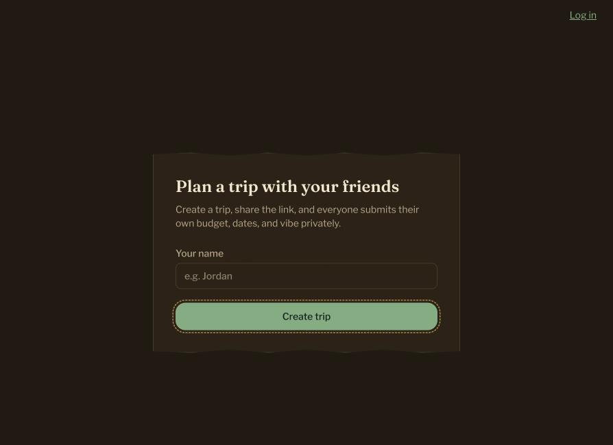
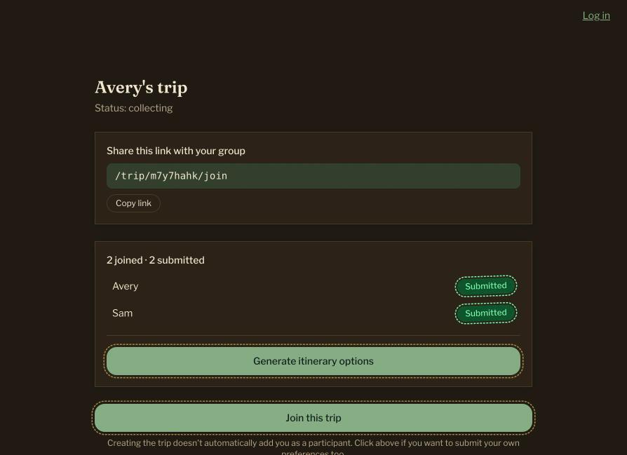
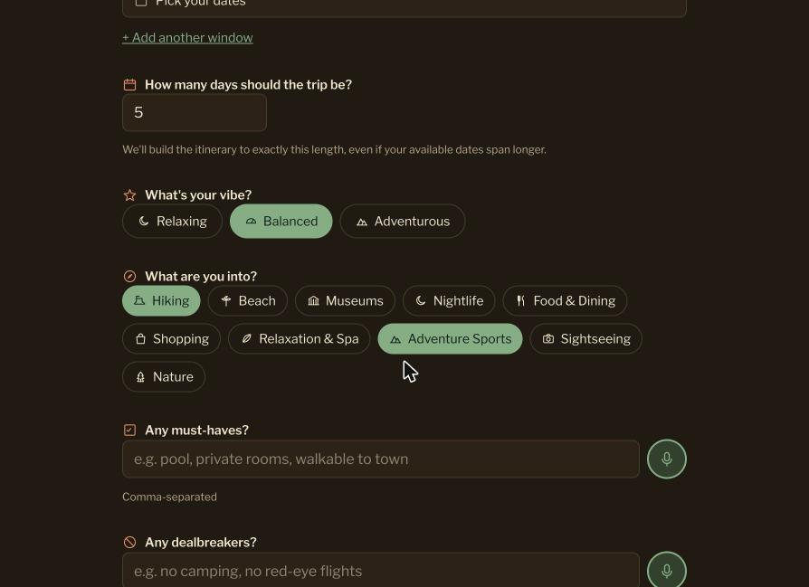
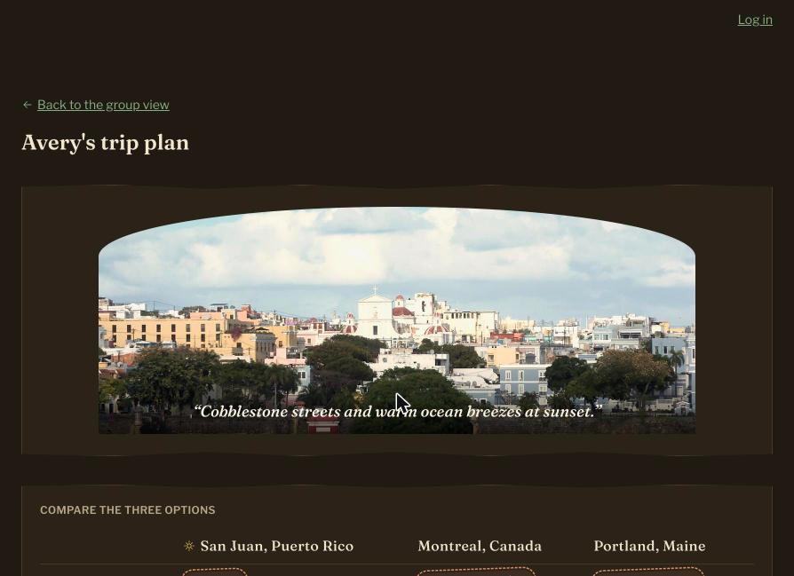
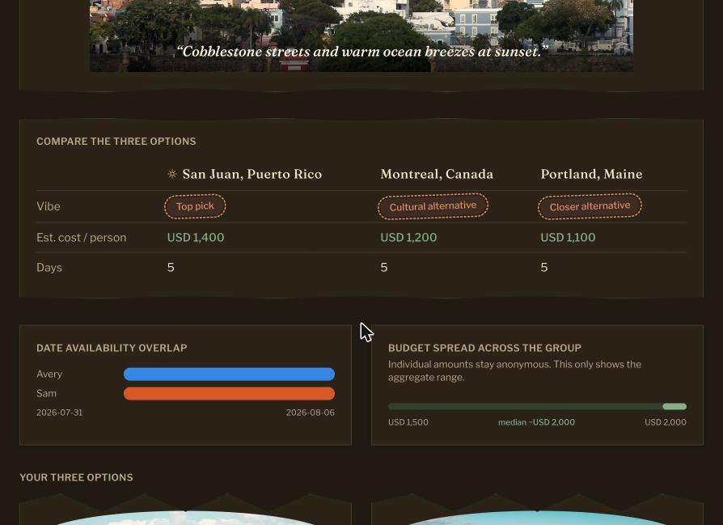
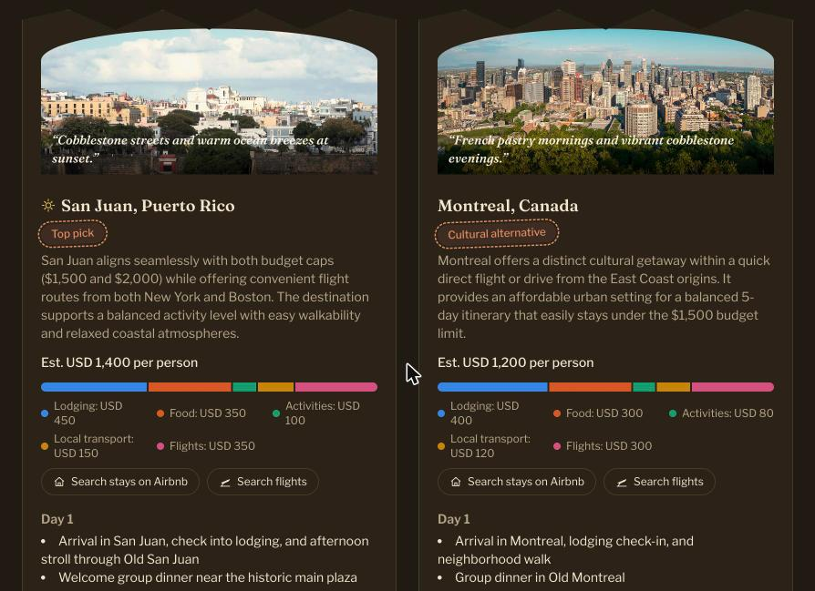

# Ta — Plan a Trip With Your Friends

*"Ta"* is a word used in Uruguay to say something is done, settled, or sorted, and that's exactly the point of this app.

Ta takes the pain out of group trip planning. One person creates a trip, shares a link, and everyone submits their own budget, travel dates, and vibe privately — no more messy group chats or spreadsheets. Once enough people have chimed in, Ta uses AI to generate three tailored destination options, complete with day-by-day itineraries, cost breakdowns, and maps, so the group can compare, vote, and lock in a plan together.

Live app: [ta-psi-five.vercel.app](https://ta-psi-five.vercel.app)

## Screenshots

**Create a trip**

**Live group view** — track who's joined and submitted in real time

**Private preferences form** — budget, dates, vibe, and interests

**Generated trip results**

**Group comparison** — cost, date overlap, and budget spread across the group

**Destination detail** — cost breakdown, day-by-day itinerary, and map

## Features

- **Create & share a trip** — Start a trip with just your name and get a shareable invite link for your group.
- **Private preference collection** — Each participant submits their own budget, home airport, available date windows, trip length, vibe (relaxing/balanced/adventurous), interests, must-haves, and dealbreakers. Submissions stay private until the itinerary is generated.
- **Optional bonus questions** — A quick round of extra questions (favorite cuisines, languages spoken, nightlife energy, preferred pace, etc.) to help fine-tune recommendations.
- **Voice input** — Speak your answers instead of typing, for free-text fields like must-haves and dealbreakers.
- **Live group view** — See who's joined and submitted in real time, with a running tally of responses.
- **AI-generated itinerary options** — Once at least two people submit, generate three destination options (a top pick, a cheaper alternative, and an alternative vibe), each with:
- A mood-setting hero photo and quote
- Estimated per-person cost, broken down by lodging, food, activities, local transport, and flights
- A full day-by-day itinerary
- An interactive map of key locations
- Quick links to search flights and stays
- **Group comparison tools** — Side-by-side comparison table, a chart of date availability overlap across the group, and an anonymized view of the group's budget spread.
- **Voting & lock-in** — Group members can upvote/downvote options and lock in a final choice.
- **Regenerate with feedback** — Not quite right? Give feedback (e.g. "cheaper," "more relaxing," "swap day 3 for something outdoors") and regenerate the itinerary.
- **Recommendations** — Group members can leave recommended spots (with attribution) for the trip.
- **Open questions for the group** — The AI automatically flags unresolved decisions (e.g. conflicting date ranges, unconfirmed activity preferences) that the group should settle before booking.
- **Nudge emails** — Optional email reminders (via Resend) to nudge participants who haven't submitted yet.
- **Accounts** — Optional login (Supabase Auth) to save and revisit your trips.

## Tech Stack

- **Framework:** [Next.js](https://nextjs.org/) 16 (App Router) + React 19 + TypeScript
- **Styling:** Tailwind CSS v4
- **Database & Auth:** [Supabase](https://supabase.com/) (Postgres, `@supabase/ssr`, `@supabase/supabase-js`)
- **AI:** Google Gemini via `@google/genai` for itinerary generation
- **Maps:** [Leaflet](https://leafletjs.com/) with OpenStreetMap tiles
- **Dates:** `date-fns` + `react-day-picker`
- **Email:** [Resend](https://resend.com/) for nudge notifications
- **Deployment:** [Vercel](https://vercel.com/)
